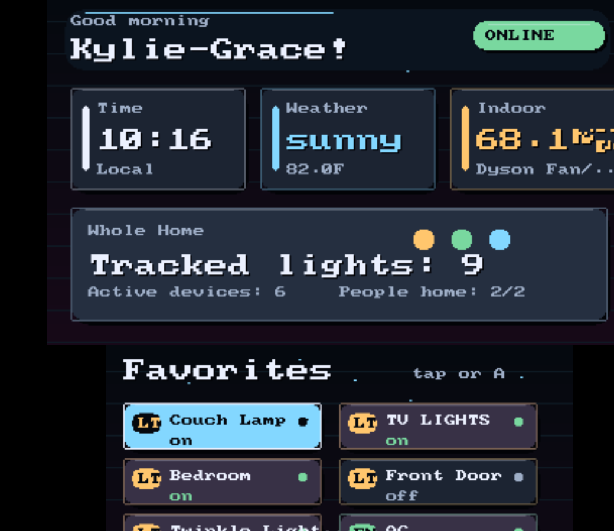

# HomePad 3DS

Native Home Assistant controls for the Nintendo 3DS.




HomePad is a dual-screen Home Assistant dashboard written as a real 3DS homebrew app. It does not render Lovelace, run a browser, or pretend your 3DS is a tablet. It translates the dashboard ideas that matter on a tiny handheld: glanceable status on the top screen, touch-friendly controls on the bottom screen, and fast access to the lights/scenes/rooms you actually use.

The current visual direction is inspired by polished Abode-style Home Assistant dashboards: dark glassy panels, warm/cool status color, family presence, weather, and room controls, rebuilt with simple 3DS-native drawing primitives.

## What Works

- Live Home Assistant REST polling for configured entities
- Overview with time, weather, indoor temperature, lights, active devices, and presence
- Favorite controls on the bottom touch screen
- Room pages with controls and highlight sensors
- People, weather, quick action, and utility pages
- Touch, D-pad, `A`, `L/R`, `X`, and `START` navigation
- Action calls for `light`, `switch`, `fan`, `scene`, and `script`
- Basic `climate` mode cycling and target temperature adjustment
- Offline/setup status messages instead of hard crashes
- Docker/Portainer-friendly build validation
- Verified in Azahar against a live Home Assistant instance

## Quick Install

You need:

- A 3DS/2DS that can launch `.3dsx` homebrew
- A Home Assistant instance reachable from the 3DS over your local network
- A Home Assistant long-lived access token
- A configured SD path at `sdmc:/3ds/homepad/`

Install:

1. Build or download `homepad.3dsx`.
2. Copy it to `sdmc:/3ds/homepad/homepad.3dsx`.
3. Copy `config/homepad.config.template.json` to `sdmc:/3ds/homepad/config.json`.
4. Edit `config.json` with your Home Assistant URL, token, people, rooms, favorites, and utility entities.
5. Launch HomePad from the Homebrew Launcher.

Azahar/Citra-style emulators usually map `sdmc:/` to a virtual SD folder. For Azahar on Windows that may be:

```text
%APPDATA%\Azahar\sdmc\3ds\homepad\config.json
```

Write `config.json` as UTF-8 without a BOM. The embedded JSON parser expects the first byte to be `{`.

## Home Assistant Setup

Create a dedicated token:

1. In Home Assistant, open your user profile.
2. Create a Long-Lived Access Token.
3. Paste it into `access_token` in `config.json`.
4. Rotate/delete that token if the SD card or device is lost.

Recommended entity choices:

- `weather_entity`: a `weather.*` entity with temperature/forecast attributes
- `indoor_temp_entity`: a whole-home or main-room temperature sensor
- `people_entities`: `person.*` entities for household presence
- `favorite_entities`: your daily toggles/scenes for the Home page
- `quick_action_entities`: scripts/scenes such as all lights off, bedtime, movie mode
- `utility_entities`: commute times, printer status, media state, homelab health, battery status
- `rooms`: short room names plus up to 6 controls and 6 highlight signals per room

HomePad polls the configured entity list individually with `/api/states/<entity_id>`. This is intentional: large Home Assistant installs can return huge `/api/states` payloads, and the 3DS is happier when it only tracks the dashboard entities it needs.

## Config Example

```json
{
  "home_assistant_url": "http://homeassistant.local:8123",
  "access_token": "PASTE_DEDICATED_LONG_LIVED_ACCESS_TOKEN_HERE",
  "display_name": "Home",
  "poll_interval_seconds": 15,
  "weather_entity": "weather.home",
  "indoor_temp_entity": "sensor.living_room_temperature",
  "people_entities": [
    "person.alex",
    "person.sam"
  ],
  "favorite_entities": [
    "light.living_room",
    "light.bedroom",
    "fan.office",
    "script.goodnight"
  ],
  "quick_action_entities": [
    "script.all_lights_off",
    "script.movie_mode",
    "script.goodnight"
  ],
  "utility_entities": [
    "sensor.commute_time",
    "sensor.printer_status",
    "binary_sensor.server_online"
  ],
  "rooms": [
    {
      "name": "Living",
      "temp_sensor": "sensor.living_room_temperature",
      "humidity_sensor": "sensor.living_room_humidity",
      "control_entities": [
        "light.living_room",
        "fan.living_room"
      ],
      "highlight_entities": [
        "sensor.living_room_temperature",
        "media_player.tv"
      ]
    }
  ]
}
```

See `config/homepad.config.template.json` and `config/example_config.json` for full-size examples and firmware limits.

## Controls

| Input | Action |
| --- | --- |
| Touch | Activate bottom-screen buttons |
| D-pad up/down | Move focus |
| D-pad left/right | Switch rooms on the Rooms page |
| `A` | Activate focused button |
| `L` / `R` | Change page |
| `X` | Force Home Assistant refresh |
| `START` | Exit |

Climate tiles:

- Tap the main tile or press `A` to cycle HVAC mode.
- Tap the small `-` / `+` controls to adjust target temperature.

## Supported Domains

Actionable:

- `light` -> `toggle`
- `switch` -> `toggle`
- `fan` -> `toggle`
- `scene` -> `turn_on`
- `script` -> `turn_on`
- `climate` -> `set_hvac_mode` / `set_temperature`

Read-only:

- `weather`
- `sensor`
- `binary_sensor`
- `person`
- `media_player`
- any configured entity from an unsupported domain

## Build From Source

Install devkitPro/devkitARM/libctru, then:

```sh
export DEVKITPRO=/opt/devkitpro
export DEVKITARM=/opt/devkitpro/devkitARM
make clean
make
```

Expected artifacts:

- `homepad.3dsx`
- `homepad.elf`
- `homepad.smdh`

On Windows with MSYS2/devkitPro, run `make` from the MSYS2 shell so `DEVKITPRO`, `DEVKITARM`, and devkitPro tools are available.

## Docker / Portainer Build Gate

The repo includes a one-shot Portainer stack for repeatable firmware builds:

```text
docker/portainer-test-stack.yml
```

It validates the example configs, builds the firmware in `devkitpro/devkitarm`, and copies artifacts to a Docker volume.

Manual equivalent:

```sh
sh tools/portainer-test.sh
```

## Validation Status

Current verified state:

- Config validation passes for both checked-in config files.
- Local devkitPro build produces `.3dsx`, `.elf`, and `.smdh`.
- Remote Docker/Portainer-style build gate passes from the pushed Gitea repo.
- Azahar 2125.1.3 launches the app and renders live Home Assistant data.
- Live proof showed `ONLINE`, all configured tracked entities reachable, real weather/temperature, presence, lights, and favorites.

See:

- `docs/BUILD.md`
- `docs/EMULATOR_VERIFICATION.md`
- `docs/PORTAINER_TESTING.md`

## Security Notes

- Use a dedicated Home Assistant long-lived token.
- Treat the SD card as sensitive because it stores that token.
- Keep this on a trusted LAN or VPN.
- HTTPS certificate verification is disabled for local/self-signed Home Assistant setups, so do not use this on hostile/public networks.
- HomePad is a hobby/homebrew dashboard, not a security boundary.

## Limitations

- Polling only; no WebSocket event stream yet.
- No camera snapshots or Lovelace card rendering.
- Uses a built-in bitmap font and software-drawn UI.
- Service payloads are intentionally simple and cover common Home Assistant actions.
- Weather detail quality depends on your chosen weather entity's attributes.
- The template config includes the author's example entity names; replace them for your home.

## Project Layout

```text
homepad-3ds/
|-- config/                 Example Home Assistant configs
|-- docker/                 Portainer/Docker build gate
|-- docs/                   Build, emulator, and test notes
|-- include/                App structs and bundled headers
|-- source/                 3DS app source
|-- tools/                  Config/build validation helpers
|-- Makefile
`-- README.md
```

## Why?

Because Home Assistant dashboards are personal, Nintendo handhelds are delightful, and sometimes the right control surface for your house is a dual-screen console from 2011.

## License

MIT. Initial implementation and project scaffolding were developed with assistance from OpenAI Codex.
